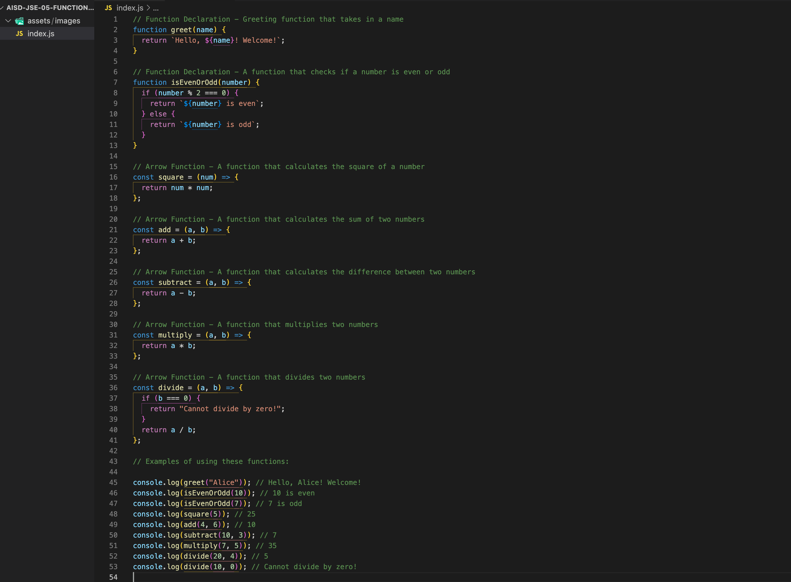

# JavaScript Functions: Declarations and Arrow Functions

##

## Description 📄
In this assignment, you will practice working with JavaScript **function declarations** and **arrow functions**. You will write functions that perform various mathematical operations, check if numbers are even or odd, and create personalized greeting messages. Each function will take arguments and return specific results. You will write all the function code inside a single file, `index.js`, and test them by logging the results to the console.

By the end of this assignment, you'll be comfortable defining and using functions, passing in arguments, and handling return values.

## Expected Project Structure 🏗️
Your project should be structured as follows:

```plaintext
js-functions-practice/
   index.js
```

## Instructions ✅

### 1. **Create the Project Folder and File**
Before you begin writing JavaScript code, ensure that you have your development environment ready.

 - [ ] Create a project folder named js-functions-practice to store your project files.

 - [ ] Inside the js-functions-practice folder, create a file named `index.js`. This will be your main JavaScript file where all your code will be written.

##

### 2. **Greeting Function (Standard Function Declaration)**
In this section, you'll write a function that takes a person's name as an argument and returns a personalized greeting using the standard function declaration syntax. After writing the function, you will test it by logging the output to the console.

  - [ ] Add the following code to your index.js file:

```javascript
// Function Declaration - Greeting function (Standard Function)
function greet(name) {
  return `Hello, ${name}! Welcome!`;
}
// Test the Greeting function
console.log(greet("Alice")); // Output: Hello, Alice! Welcome!
```
 - [ ] Run your code using node in the terminal:

```bash
node index.js

```
**Expected Output:**

```bash
Hello, Alice! Welcome!
```

**Explanation:**
- This is a standard function declaration that takes one argument, name, and returns a greeting string.
- It uses a template literal (the string with ${name}) to dynamically insert the name into the greeting message.
- You can reuse this function by passing in different names to greet different users.

##

### 3. **Greeting Function (Arrow Function)**
Here, you'll rewrite the same greeting function using an arrow function syntax. 
This will demonstrate how arrow functions are a more concise way to write functions.

  - [ ] Add the following code to your index.js file:

```javascript
// Arrow Function - Greeting function (Arrow Function)
const greetArrow = (name) => `Hello, ${name}! Welcome!`;

// Test the Arrow Function Greeting
console.log(greetArrow("Bob")); // Output: Hello, Bob! Welcome!

```
 - [ ] Run your code using node in the terminal:

```bash
node index.js

```
**Expected Output:**

```bash
Hello, Bob! Welcome!

```

**Explanation:**
- This is an arrow function that performs the same task as the previous function, but with a shorter syntax.
- Arrow functions allow you to omit the return keyword if the function body consists of a single expression.
- The result is the same: a personalized greeting that uses template literals to insert the name.

##

### 4. **Even or Odd Checker**
Here, you'll write a function to determine whether a number is even or odd using a standard function declaration. 
After defining the function, test it using console.log() with sample inputs.

  - [ ] Add the following code to your index.js file:

```javascript
// Function Declaration - Check if a number is even or odd
function isEvenOrOdd(number) {
  if (number % 2 === 0) {
    return `${number} is even`;
  } else {
    return `${number} is odd`;
  }
}

// Test the Even or Odd function
console.log(isEvenOrOdd(10)); // Output: 10 is even
console.log(isEvenOrOdd(7));  // Output: 7 is odd

```
 - [ ] Run your code using node in the terminal:

```bash
node index.js

```
**Expected Output:**

```bash
10 is even
7 is odd

```

**Explanation:**
- This function uses a conditional statement (the if...else block) to check if the number is even or odd.
- The modulus operator (%) checks if the number is divisible by 2. If the remainder is 0, the number is even; otherwise, it's odd.
- The function returns a message dynamically including the number and whether it’s even or odd.

##

### 5. **Square Function Using Arrow Function**
Here, you'll write an arrow function that takes a number as input and returns the square of the number.

  - [ ] Add the following code to your index.js file:

```javascript
// Arrow Function - A function that calculates the square of a number
const square = (num) => num * num;

// Test the Square function
console.log(square(5)); // Output: 25

```
 - [ ] Run your code using node in the terminal:

```bash
node index.js

```
**Expected Output:**

```bash
25

```

**Explanation:**
- This is an arrow function that takes in one argument, num, and returns the square of that number.
- The arrow function syntax is more concise here because the body contains a single expression. 
- There is no need for a return statement when using arrow functions in this way.
- The function can be used to calculate the square of any number by passing the number as an argument.

##

### 6. **Add Function Using Arrow Function**
In this step, you'll write an arrow function that takes two numbers and returns their sum.

  - [ ] Add the following code to your index.js file:

```javascript
// Arrow Function - A function that calculates the sum of two numbers
const add = (a, b) => a + b;

// Test the Add function
console.log(add(4, 6)); // Output: 10

```
 - [ ] Run your code using node in the terminal:

```bash
node index.js

```
**Expected Output:**

```bash
10

```

**Explanation:**
- This arrow function takes two numbers as input (a and b) and returns their sum.
- Again, there is no need for the return keyword because the function consists of a single expression.
- Arrow functions are especially useful for short operations like this one.

##

### 7. **Subtract Function Using Arrow Function**
Next, you'll write an arrow function that calculates the difference between two numbers.

  - [ ] Add the following code to your index.js file:

```javascript
// Arrow Function - A function that calculates the difference between two numbers
const subtract = (a, b) => a - b;

// Test the Subtract function
console.log(subtract(10, 3)); // Output: 7

```
 - [ ] Run your code using node in the terminal:

```bash
node index.js

```
**Expected Output:**

```bash
7

```

**Explanation:**
- This arrow function takes two numbers as input and returns the difference (a - b).
- The use of arrow functions allows for a concise and readable format, especially for simple mathematical operations.
- You can reuse this function with any two numbers to calculate their difference.

### 8. **Multiply Function Using Arrow Function**
Now, you'll write an arrow function that multiplies two numbers together.

  - [ ] Add the following code to your index.js file:

```javascript
// Arrow Function - A function that multiplies two numbers
const multiply = (a, b) => a * b;

// Test the Multiply function
console.log(multiply(7, 5)); // Output: 35

```
 - [ ] Run your code using node in the terminal:

```bash
node index.js

```
**Expected Output:**

```bash
35

```

**Explanation:**
- This arrow function takes two numbers as input and returns their product (a * b).
- It's a simple and efficient way to multiply two numbers, and the arrow function format keeps the syntax clean and concise.
- You can test this with any two numbers to get their product.

##

### 9. **Divide Function Using Arrow Function**
Finally, you'll write an arrow function that divides two numbers and handles division by zero.

  - [ ] Add the following code to your index.js file:

```javascript
// Arrow Function - A function that divides two numbers
const divide = (a, b) => {
  if (b === 0) {
    return "Cannot divide by zero!";
  }
  return a / b;
};

// Test the Divide function
console.log(divide(20, 4)); // Output: 5
console.log(divide(10, 0)); // Output: Cannot divide by zero!

```
 - [ ] Run your code using node in the terminal:

```bash
node index.js

```
**Expected Output:**

```bash
5
Cannot divide by zero!

```

**Explanation:**
- This arrow function divides two numbers and includes a conditional check to handle division by zero.
- The if statement ensures that if the divisor (b) is zero, the function will return an error message instead of performing the division.
- This function is more robust as it handles both normal division and error cases.

##

## Conclusion 📄

In this assignment, you practiced defining and using both **function declarations** and **arrow functions** in JavaScript. By writing functions to perform tasks such as greeting users, checking if numbers are even or odd, and performing basic math operations, you enhanced your understanding of how functions take in arguments, process them, and return results.

### Key Takeaways:
1. **Standard Functions**: These use the `function` keyword and are suitable for more complex functions with multiple lines or when needing a more explicit structure. They can handle more extensive logic and are compatible with older versions of JavaScript.
2. **Arrow Functions**: Arrow functions offer a shorter and cleaner syntax. They omit the `function` keyword, and if the function body consists of a single expression, you can also omit the `return` keyword. Arrow functions are excellent for concise logic but may behave differently in more complex contexts, particularly with `this` keyword handling.
   
### Further Practice:
- **Modify the Passed Values**: Go back and change the values being passed into each function to test how the functions behave with different inputs. For example, try passing different names to the greeting function or test the even/odd function with other numbers. 
- **Explore Arrow Functions Further**: Consider converting the functions you wrote as standard functions into arrow functions. This will give you more familiarity with their syntax and how they compare to regular function declarations.
  
Understanding both types of functions and how to use them interchangeably will give you more flexibility in writing clean, efficient code, especially as you work with modern JavaScript features. Keep experimenting and modifying the functions to see how changes to inputs can lead to different outputs and outcomes.
"""

##

### Solution codebase 👀
🛑 **Only use this as a reference** 🛑

💾 **Not something to copy and paste** 💾

**Note:**  This lab references a solution file located [here](https://github.com/HackerUSA-CE/aisd-jse-05-functions-2/tree/solution) (link not shown).


---
© All rights reserved to ThriveDX